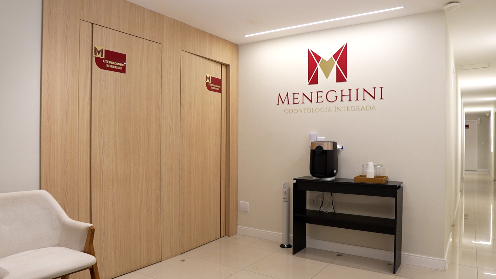
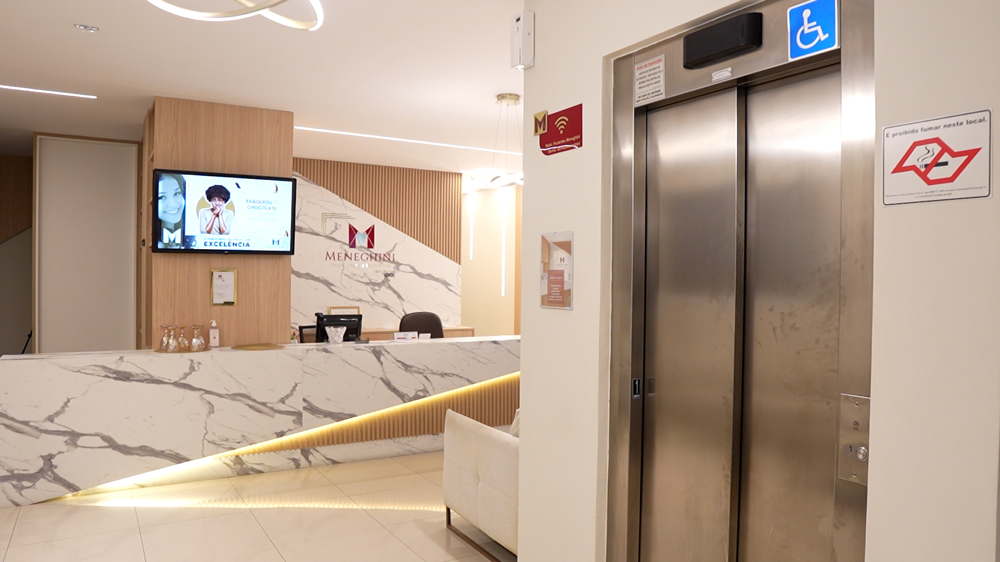
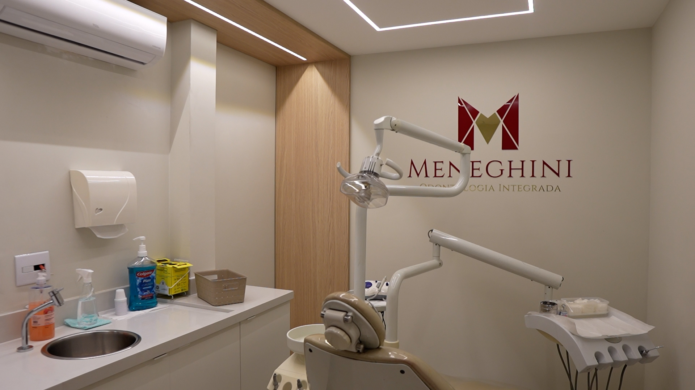
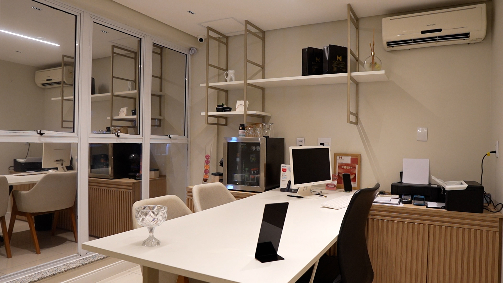
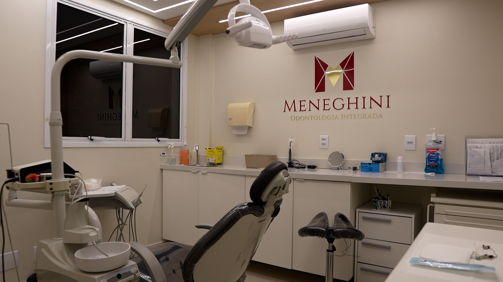
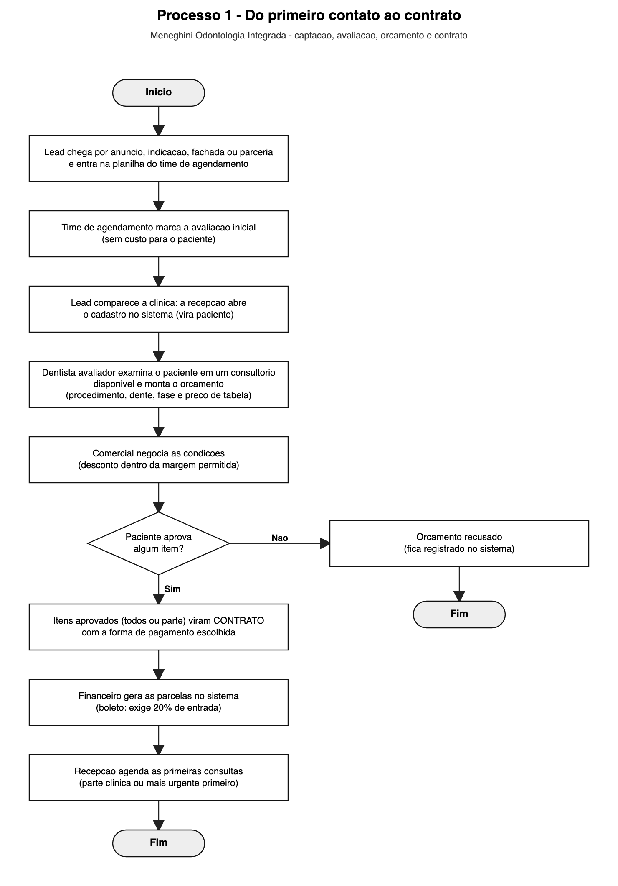
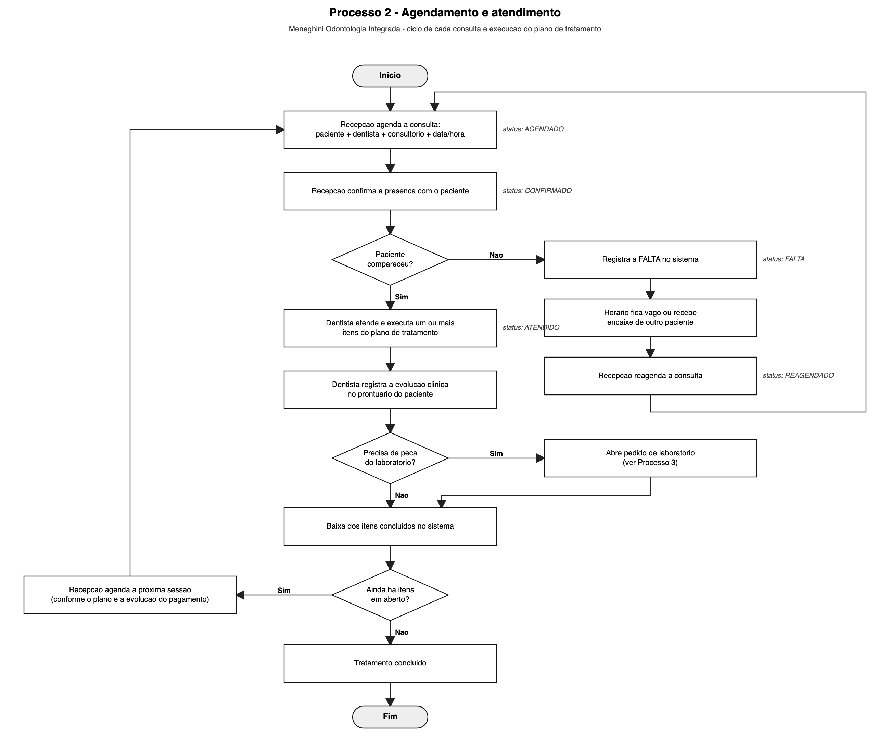
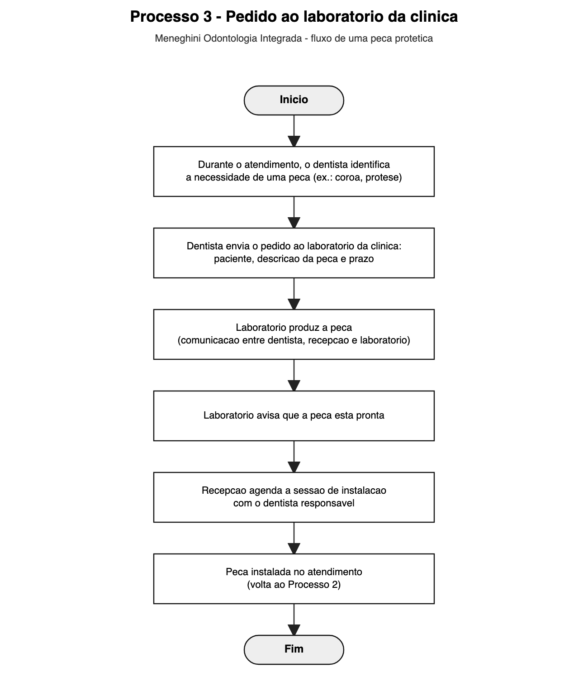
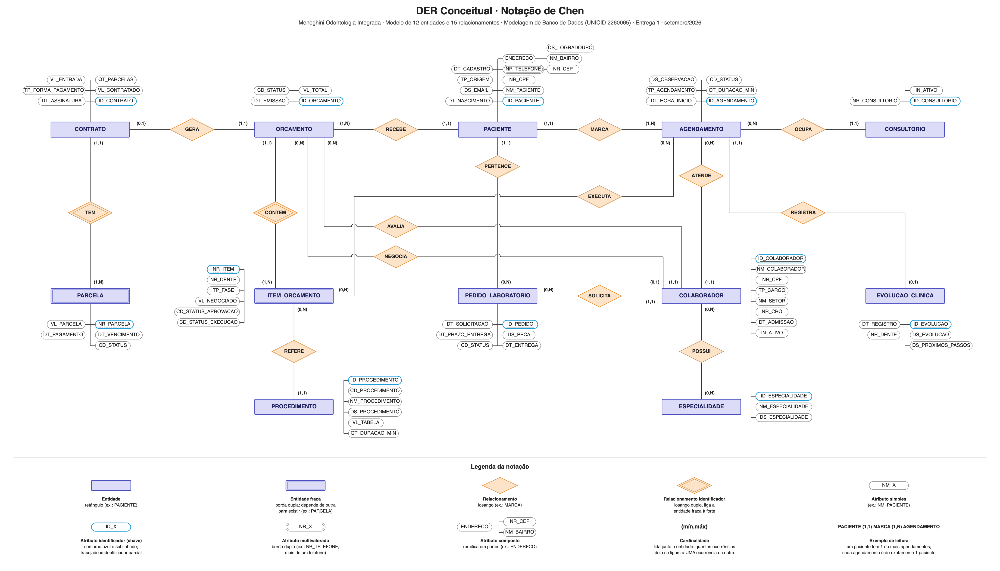

# Modelagem de Banco de Dados para a Clínica Meneghini Odontologia Integrada

**Disciplina:** Modelagem de Banco de Dados (2260065), Análise e Desenvolvimento de Sistemas, UNICID
**Professor:** Cid Rodrigues de Andrade
**Entrega 1: Modelo Conceitual (DER)**, setembro de 2026

## Metadados

| Nome | RGM |
|---|---|
| Renan Silva dos Santos | 47203099 |
| Leonardo Alves Tavares Calixta | 47323485 |
| David Carlos da Fonseca Junior | 46638202 |

---

## Introdução

A Meneghini Odontologia Integrada é uma clínica odontológica particular no bairro Jardim São Paulo, em São Paulo (SP). Na mesma unidade trabalham dentistas de várias especialidades, um laboratório próprio de próteses e as equipes de recepção, comercial, financeiro e relacionamento. A clínica usa um software de gestão (Controle Odonto), mas ele tem integração limitada com outras ferramentas, e por isso parte das informações fica espalhada entre o sistema, planilhas e a comunicação entre os setores.

**Problema:** a clínica precisa acompanhar o caminho completo do paciente (primeiro contato, avaliação, orçamento, contrato, consultas, pedidos ao laboratório e pagamentos), e hoje essas informações não estão organizadas em um único modelo de dados.

**Objetivo:** levantar os requisitos e as regras de funcionamento da clínica por meio de pesquisa de campo e construir o modelo conceitual (DER) de um sistema de gestão de informações que organize esses dados sem redundância e sem inconsistência.

**Delimitação:** o modelo cobre o núcleo clínico, comercial e financeiro da clínica: cadastro de pacientes e colaboradores, agendamento, avaliação, orçamento, contrato e parcelas, execução dos procedimentos, evolução clínica e pedidos ao laboratório. Ficam fora desta etapa a folha de pagamento, as compras e o estoque de materiais, as campanhas de marketing e a contabilidade. Os leads (pessoas que ainda não compareceram à clínica) também ficam fora: eles são controlados em uma planilha do time de agendamento, a maioria não vira paciente e só esse time tem acesso. A pessoa entra no modelo quando comparece à avaliação e a recepção abre o cadastro. Os materiais (resinas, implantes etc.) variam por especialidade e não foram levantados na pesquisa de campo, então ficam para uma etapa futura. A clínica atende somente particular, sem convênios, e por isso o modelo não tem entidades de convênio.

---

## 1. Caracterização da Organização

**Nome e natureza da organização:** Meneghini Odontologia Integrada, clínica odontológica privada, com fins lucrativos. Oferece avaliação, clínica geral, implantodontia, ortodontia e endodontia, e tem laboratório de prótese próprio.

**Contexto e porte:** a clínica tem uma única unidade, com 7 consultórios (7 cadeiras ativas) e cerca de 30 colaboradores, entre dentistas (implantodontia, clínica geral, ortodontia e endodontia), auxiliares de saúde bucal, recepção, financeiro, relacionamento, campanha, marketing, comercial, laboratório e apoio (manobrista). O atendimento é particular, sem convênio. A operação é diária, com agenda dividida por dentista, consultório e horário.

**Problemas e necessidades identificados:**

Hoje as informações da clínica ficam espalhadas. A planilha de leads é do setor de agendamento; a recepção, por exemplo, só tem contato com quem já é paciente da clínica. Existem dois CRMs: um de marketing, para gestão de leads e campanhas, e outro próprio para odontologia, o Controle Odonto, com o prontuário do paciente. A consequência é desinformação, ou a informação existe mas não de maneira facilitada e simples de entender, e sem esse contexto fica mais difícil e mais lento agir.

O pedido ao laboratório e o prazo de entrega da peça também são combinados na conversa entre dentista, recepção e laboratório, sem um registro único com status. E como o paciente pode aprovar só parte do orçamento, é preciso acompanhar item a item o que está em aberto e o que já foi concluído.

**Justificativa da escolha:** o grupo tem acesso garantido à clínica e ao proprietário para a pesquisa de campo. A clínica tem porte adequado ao trabalho: os processos de captação, avaliação, orçamento, contrato, agendamento, atendimento, laboratório e pagamento geram um modelo com várias entidades e relacionamentos, sem ficar grande demais para esta primeira etapa. Por ser uma organização real e em funcionamento, as regras de negócio foram levantadas diretamente com quem opera a clínica.

**Evidências da organização:**

| Item | Dado |
|---|---|
| Endereço | Av. Leôncio de Magalhães, 162, Jardim São Paulo, São Paulo/SP |
| Telefone | (11) 93455-9297 |
| E-mail | meneghiniodonto@gmail.com |
| Link no Google | [Meneghini Odontologia Integrada no Google Maps](https://www.google.com/maps/search/?api=1&query=Meneghini+Odontologia+Integrada+-+Dentista+Zona+Norte%2C+Av.+Leôncio+de+Magalhães%2C+162+-+Jardim+São+Paulo%2C+São+Paulo+-+SP) |
| Responsável entrevistado | Fábio Meneghini (proprietário) |
| Visita e entrevista | Feitas por Renan Silva dos Santos, em nome do grupo |

Fotos do local:

  
  
  

  
  

*Da esquerda para a direita, de cima para baixo: entrada com o nome da clínica, recepção, consultório, sala comercial/administrativa e um segundo consultório.*

---

## 2. Processos de Negócio

**Principais processos mapeados:**

1. Captação e cadastro do paciente. O lead chega por anúncio (principal canal), indicação, fachada ou parceria e fica registrado na planilha do time de agendamento, que marca a avaliação inicial (sem custo). Quando o lead comparece à clínica, a recepção abre o cadastro no sistema e ele passa a ser paciente. A avaliação acontece em um consultório disponível, com o dentista avaliador.
2. Avaliação, orçamento e contrato. O dentista avaliador examina o paciente e monta o orçamento com procedimentos avulsos (por dente e por fase). O setor comercial negocia. Os itens aprovados viram contrato com a forma de pagamento, e o financeiro gera as parcelas.
3. Agendamento e atendimento. A recepção agenda as consultas (paciente, dentista, consultório, data e hora), confirma a presença e registra falta ou atendimento. O dentista executa os itens do plano e registra a evolução clínica.
4. Pedido ao laboratório. Quando o tratamento precisa de uma peça (coroa, prótese etc.), o dentista faz o pedido ao laboratório da própria clínica, que produz a peça e avisa quando está pronta.
5. Pagamento. As parcelas são registradas e baixadas no sistema. O tratamento avança conforme o plano e a evolução do pagamento.

**Fluxogramas:**

Processo 1: do primeiro contato ao contrato (captação, avaliação, orçamento, contrato e parcelas).

Processo 2: agendamento e atendimento (ciclo de cada consulta, com os status do agendamento).

Processo 3: pedido ao laboratório da clínica.

Os três processos se ligam assim: o Processo 1 termina com o contrato assinado e as primeiras consultas agendadas, que são o início do Processo 2. Dentro do Processo 2, sempre que o dentista precisa de uma peça, abre-se um pedido no Processo 3, e a peça pronta é instalada em uma consulta do Processo 2. As parcelas geradas no Processo 1 são baixadas pelo financeiro ao longo do tratamento, e a agenda das próximas sessões segue o plano e o andamento do pagamento.

---

## 3. Requisitos do Sistema

### 3.1 Requisitos Funcionais

| Código | O sistema deve... |
|---|---|
| RF01 | Cadastrar pacientes com dados pessoais, contato (um ou mais telefones), endereço e canal de origem (anúncio, indicação, fachada ou parceria). |
| RF02 | Cadastrar colaboradores com cargo e setor e, para os dentistas, o número do CRO e as especialidades (uma ou mais). |
| RF03 | Cadastrar os consultórios da clínica. |
| RF04 | Manter a tabela de procedimentos com código, nome e preço de tabela. |
| RF05 | Agendar avaliações e consultas informando paciente, dentista, consultório, data e hora. |
| RF06 | Registrar a mudança de status do agendamento: agendado, confirmado, atendido, falta e reagendado. |
| RF07 | Avisar quando houver conflito de agenda (mesmo consultório ou mesmo dentista no mesmo horário). |
| RF08 | Montar orçamentos com itens por procedimento, informando dente e fase (cirúrgica, protética ou ambas). |
| RF09 | Registrar o valor negociado de cada item (com desconto) e a aprovação ou recusa item a item. |
| RF10 | Gerar o contrato a partir dos itens aprovados, com a forma de pagamento escolhida. |
| RF11 | Gerar as parcelas do contrato e permitir dar baixa em cada parcela paga. |
| RF12 | Registrar a evolução clínica de cada consulta atendida. |
| RF13 | Registrar pedidos ao laboratório, com paciente, dentista solicitante, peça, prazo e status. |
| RF14 | Acompanhar os itens do plano de tratamento em aberto e concluídos. |
| RF15 | Consultar o histórico do paciente: agendamentos, orçamentos, contratos, parcelas, evoluções e pedidos. |

### 3.2 Requisitos Não Funcionais

| Código | Requisito |
|---|---|
| RNF01 | Segurança e privacidade (LGPD): o acesso deve ser por perfil de usuário. A evolução clínica (dado de saúde, sensível) só pode ser vista pelos dentistas, e os dados de pagamento só pelo financeiro. |
| RNF02 | Disponibilidade: a agenda é usada o dia inteiro pela recepção, então o sistema precisa estar disponível durante todo o horário de funcionamento. |
| RNF03 | Usabilidade: a recepção precisa marcar, confirmar e reagendar consultas de forma rápida e simples. |
| RNF04 | Desempenho: a consulta da agenda do dia e a busca de paciente por nome devem responder em poucos segundos. |
| RNF05 | Rastreabilidade: o sistema deve registrar quem fez cada alteração importante (baixa de parcela, mudança de status, conclusão de item). |
| RNF06 | Integração: o modelo deve permitir, no futuro, a troca de dados com outros sistemas. Hoje essa é a principal limitação do software usado. |

---

## 4. Regras de Negócio

**Regras operacionais:**

| Código | Regra |
|---|---|
| RN01 | A avaliação inicial não tem custo para o paciente. |
| RN02 | O orçamento é montado pelo dentista avaliador, com procedimentos avulsos e especificados (procedimento, dente e fase). |
| RN03 | O preço de cada procedimento é tabelado; dentista e comercial podem dar desconto, dentro da margem permitida pela clínica. |
| RN04 | O paciente pode aprovar apenas parte dos itens do orçamento. |
| RN05 | Um orçamento com itens aprovados (todos ou parte) vira um contrato; um orçamento recusado não gera contrato. |
| RN06 | O pagamento pode ser à vista, parcelado no cartão ou parcelado no boleto; no boleto é exigida entrada de 20%. |
| RN07 | O pagamento é lançado por contrato, em parcelas; o financeiro gera a cobrança mês a mês pelo sistema e dá baixa em cada parcela paga. O comercial fecha o tratamento com o paciente novo; o financeiro cuida da cobrança e da gestão de quem já está em tratamento. |
| RN08 | O tratamento é executado de acordo com o planejamento e com a evolução do pagamento. |
| RN09 | Todo agendamento tem exatamente um paciente, um dentista, um consultório e uma data/hora. |
| RN10 | Os status possíveis de um agendamento são: agendado, confirmado, atendido, falta e reagendado. |
| RN11 | A falta do paciente fica registrada; o horário fica vago ou recebe o encaixe de outro paciente. |
| RN12 | Em uma consulta o dentista pode executar um ou mais itens do plano; cada item começa "em aberto" e passa a "concluído" quando finalizado. |
| RN13 | O consultório de cada dentista é definido pela agenda e pela data, e pode mudar ao longo da semana. |
| RN14 | Um dentista pode ter mais de uma especialidade. |
| RN15 | O pedido ao laboratório é feito por paciente, solicitado por um dentista, e o prazo é combinado entre dentista, recepção e laboratório. |
| RN16 | A evolução clínica é registrada apenas em agendamentos atendidos. |
| RN17 | Antes de comparecer à clínica, a pessoa é um lead controlado em planilha pelo time de agendamento; ela só entra no sistema (vira paciente) quando comparece à avaliação e a recepção abre o cadastro. |

**Restrições organizacionais:**

- LGPD: a clínica trata dados pessoais (nome, CPF, contato) e dados sensíveis de saúde (evolução clínica). Pela Lei 13.709/2018, esses dados exigem acesso restrito e finalidade definida. No modelo, a evolução clínica ficou em uma entidade separada para que o acesso a ela possa ser controlado. Neste trabalho não usamos nenhum dado real de paciente ou colaborador; os exemplos são fictícios.
- Registro profissional: todo dentista precisa ter registro no CRO, então o CRO é um atributo obrigatório para colaboradores do tipo dentista.
- Atendimento particular: a clínica não trabalha com convênios, então não existem entidades de convênio ou guia.
- Uma única unidade: o modelo não tem entidade de unidade/filial, mas o consultório é uma entidade própria, o que permite crescer no futuro.
- Sistema atual: a clínica já usa o Controle Odonto, e o modelo proposto precisa ser compatível com o que a equipe já registra (agenda, orçamento por item, parcelas, prontuário).

---

## 5. Dicionário de Dados Conceitual (Preliminar)

Convenções adotadas (seguindo o exemplo de dicionário de dados apresentado em aula): os nomes dos atributos usam os prefixos `ID_` (identificador), `NM_` (nome), `DT_` (data), `TP_` (tipo), `CD_` (código ou status), `QT_` (quantidade), `IN_` (indicador sim/não) e `DS_` (descrição). Acrescentamos `NR_` (número de documento ou número sequencial) e `VL_` (valor em reais). Na definição de cada entidade, `@` marca o identificador, `+` liga os atributos, `( )` indica atributo opcional e `1{ }N` indica atributo multivalorado.

Todos os exemplos de valores citados abaixo são fictícios.

### PACIENTE

Pessoa que procura a clínica e passa pela avaliação inicial.

`PACIENTE = @ID_PACIENTE + NM_PACIENTE + NR_CPF + DT_NASCIMENTO + 1{NR_TELEFONE}N + (DS_EMAIL) + ENDERECO + DT_CADASTRO + TP_ORIGEM`
`ENDERECO = DS_LOGRADOURO + NM_BAIRRO + NR_CEP`

| Atributo | Descrição | Regra de negócio associada |
|---|---|---|
| ID_PACIENTE | Número que identifica o paciente no sistema | Obrigatório, único, gerado automaticamente |
| NM_PACIENTE | Nome completo do paciente | Obrigatório |
| NR_CPF | CPF do paciente | Obrigatório e único; necessário para o contrato |
| DT_NASCIMENTO | Data de nascimento | Obrigatório |
| NR_TELEFONE | Telefone(s) de contato | Pelo menos um; pode haver mais de um (multivalorado); usado para confirmar as consultas |
| DS_EMAIL | E-mail de contato | Opcional |
| ENDERECO (DS_LOGRADOURO, NM_BAIRRO, NR_CEP) | Endereço do paciente (atributo composto) | Obrigatório para o contrato |
| DT_CADASTRO | Data em que o paciente foi cadastrado | Preenchida automaticamente no cadastro |
| TP_ORIGEM | Como o paciente chegou à clínica | Valores possíveis: anúncio, indicação, fachada, parceria |

### COLABORADOR

Pessoa que trabalha na clínica: dentistas, auxiliares, recepção, financeiro, comercial, relacionamento, campanha, marketing, laboratório e apoio.

`COLABORADOR = @ID_COLABORADOR + NM_COLABORADOR + NR_CPF + TP_CARGO + NM_SETOR + (NR_CRO) + DT_ADMISSAO + IN_ATIVO`

| Atributo | Descrição | Regra de negócio associada |
|---|---|---|
| ID_COLABORADOR | Número que identifica o colaborador | Obrigatório, único |
| NM_COLABORADOR | Nome completo | Obrigatório |
| NR_CPF | CPF do colaborador | Obrigatório e único |
| TP_CARGO | Função na clínica (ex.: dentista, auxiliar, recepcionista, financeiro, comercial, laboratório) | Obrigatório; só colaboradores com cargo "dentista" podem atender agendamentos e ter especialidades |
| NM_SETOR | Setor em que trabalha (ex.: clínico, recepção, financeiro, comercial, laboratório) | Obrigatório |
| NR_CRO | Número de registro no Conselho Regional de Odontologia | Obrigatório e único para dentistas; vazio para os demais cargos |
| DT_ADMISSAO | Data de entrada na clínica | Obrigatório |
| IN_ATIVO | Indica se o colaborador está ativo | Colaborador inativo não pode ser escolhido em novos agendamentos, mas seu histórico é mantido |

### ESPECIALIDADE

Área da odontologia em que um dentista atua.

`ESPECIALIDADE = @ID_ESPECIALIDADE + NM_ESPECIALIDADE + (DS_ESPECIALIDADE)`

| Atributo | Descrição | Regra de negócio associada |
|---|---|---|
| ID_ESPECIALIDADE | Identificador da especialidade | Obrigatório, único |
| NM_ESPECIALIDADE | Nome da especialidade (ex.: implantodontia, clínica geral, ortodontia, endodontia) | Obrigatório e único |
| DS_ESPECIALIDADE | Descrição resumida | Opcional |

### CONSULTORIO

Sala com cadeira odontológica onde os atendimentos acontecem.

`CONSULTORIO = @ID_CONSULTORIO + NR_CONSULTORIO + IN_ATIVO`

| Atributo | Descrição | Regra de negócio associada |
|---|---|---|
| ID_CONSULTORIO | Identificador do consultório | Obrigatório, único |
| NR_CONSULTORIO | Número da sala (a clínica tem 7) | Obrigatório e único |
| IN_ATIVO | Indica se o consultório está em uso | Só consultórios ativos podem receber agendamentos |

### PROCEDIMENTO

Item da tabela de serviços da clínica, com preço de tabela.

`PROCEDIMENTO = @ID_PROCEDIMENTO + CD_PROCEDIMENTO + NM_PROCEDIMENTO + (DS_PROCEDIMENTO) + VL_TABELA + (QT_DURACAO_MIN)`

| Atributo | Descrição | Regra de negócio associada |
|---|---|---|
| ID_PROCEDIMENTO | Identificador do procedimento | Obrigatório, único |
| CD_PROCEDIMENTO | Código interno usado na tabela de preços (ex.: `IMP-01`) | Obrigatório e único |
| NM_PROCEDIMENTO | Nome do procedimento (ex.: limpeza, restauração, canal, implante) | Obrigatório |
| DS_PROCEDIMENTO | Descrição do que o procedimento inclui | Opcional |
| VL_TABELA | Preço de tabela em reais | Obrigatório; é a base do orçamento. O desconto é dado no item, nunca aqui |
| QT_DURACAO_MIN | Duração estimada em minutos | Opcional; ajuda a montar a agenda |

### ORCAMENTO

Proposta de tratamento montada na avaliação, composta por itens.

`ORCAMENTO = @ID_ORCAMENTO + DT_EMISSAO + VL_TOTAL + CD_STATUS + 1{ITEM_ORCAMENTO}N`

| Atributo | Descrição | Regra de negócio associada |
|---|---|---|
| ID_ORCAMENTO | Identificador do orçamento | Obrigatório, único |
| DT_EMISSAO | Data da avaliação em que o orçamento foi montado | Obrigatório |
| VL_TOTAL | Soma dos valores negociados dos itens aprovados | Calculado a partir dos itens |
| CD_STATUS | Situação do orçamento | Valores: em negociação, aprovado, aprovado parcialmente, recusado |

### ITEM_ORCAMENTO (entidade fraca)

Cada procedimento dentro de um orçamento. Só existe dentro de um orçamento.

`ITEM_ORCAMENTO = @NR_ITEM + (NR_DENTE) + TP_FASE + VL_NEGOCIADO + CD_STATUS_APROVACAO + CD_STATUS_EXECUCAO`

(`NR_ITEM` é identificador parcial: só identifica o item dentro do orçamento ao qual pertence.)

| Atributo | Descrição | Regra de negócio associada |
|---|---|---|
| NR_ITEM | Número sequencial do item dentro do orçamento | Identificador parcial: só identifica o item dentro do orçamento ao qual pertence (entidade fraca) |
| NR_DENTE | Dente ao qual o procedimento se refere (ex.: 26) | Opcional, pois alguns procedimentos não são por dente (ex.: limpeza) |
| TP_FASE | Fase do procedimento | Valores: cirúrgica, protética, ambas (usado principalmente em implantes) |
| VL_NEGOCIADO | Valor final do item após o desconto | Não pode ser maior que o preço de tabela; o desconto fica dentro da margem permitida |
| CD_STATUS_APROVACAO | Se o paciente aprovou o item | Valores: aprovado, recusado. Cada item é aprovado separadamente |
| CD_STATUS_EXECUCAO | Andamento do item | Valores: em aberto, concluído. Começa em aberto e muda quando o dentista finaliza |

### CONTRATO

Formalização dos itens aprovados, com a forma de pagamento.

`CONTRATO = @ID_CONTRATO + DT_ASSINATURA + VL_CONTRATADO + TP_FORMA_PAGAMENTO + QT_PARCELAS + (VL_ENTRADA) + 1{PARCELA}N`

| Atributo | Descrição | Regra de negócio associada |
|---|---|---|
| ID_CONTRATO | Identificador do contrato | Obrigatório, único |
| DT_ASSINATURA | Data em que o paciente fechou o contrato | Obrigatório |
| VL_CONTRATADO | Valor total contratado | Igual à soma dos itens aprovados do orçamento |
| TP_FORMA_PAGAMENTO | Forma de pagamento | Valores: à vista, cartão parcelado, boleto parcelado |
| QT_PARCELAS | Quantidade de parcelas | 1 quando à vista |
| VL_ENTRADA | Valor da entrada | Obrigatório no boleto: no mínimo 20% do valor contratado |

### PARCELA (entidade fraca)

Cada pagamento previsto de um contrato.

`PARCELA = @NR_PARCELA + VL_PARCELA + DT_VENCIMENTO + (DT_PAGAMENTO) + CD_STATUS`

(`NR_PARCELA` é identificador parcial: só identifica a parcela dentro do contrato ao qual pertence.)

| Atributo | Descrição | Regra de negócio associada |
|---|---|---|
| NR_PARCELA | Número da parcela dentro do contrato | Identificador parcial: só identifica a parcela dentro do contrato ao qual pertence (entidade fraca) |
| VL_PARCELA | Valor da parcela | Obrigatório |
| DT_VENCIMENTO | Data de vencimento | Obrigatório |
| DT_PAGAMENTO | Data em que foi paga | Preenchida quando o financeiro dá a baixa |
| CD_STATUS | Situação da parcela | Valores: aberta, paga, atrasada |

### AGENDAMENTO

Consulta marcada: um paciente, com um dentista, em um consultório, em uma data e hora.

`AGENDAMENTO = @ID_AGENDAMENTO + DT_HORA_INICIO + QT_DURACAO_MIN + TP_AGENDAMENTO + CD_STATUS + (DS_OBSERVACAO)`

| Atributo | Descrição | Regra de negócio associada |
|---|---|---|
| ID_AGENDAMENTO | Identificador do agendamento | Obrigatório, único |
| DT_HORA_INICIO | Data e hora de início | Obrigatório; não pode haver dois agendamentos no mesmo consultório, nem o mesmo dentista em dois consultórios, no mesmo horário |
| QT_DURACAO_MIN | Duração prevista em minutos | Obrigatório |
| TP_AGENDAMENTO | Tipo da consulta | Valores: avaliação (sem custo), tratamento |
| CD_STATUS | Situação do agendamento | Valores: agendado, confirmado, atendido, falta, reagendado |
| DS_OBSERVACAO | Observação da recepção | Opcional |

### EVOLUCAO_CLINICA

Registro, no prontuário, do que o dentista fez na consulta.

`EVOLUCAO_CLINICA = @ID_EVOLUCAO + DT_REGISTRO + DS_EVOLUCAO + (NR_DENTE) + (DS_PROXIMOS_PASSOS)`

| Atributo | Descrição | Regra de negócio associada |
|---|---|---|
| ID_EVOLUCAO | Identificador da evolução | Obrigatório, único |
| DT_REGISTRO | Data e hora do registro | Obrigatório |
| DS_EVOLUCAO | O que foi feito na consulta e o que foi finalizado | Obrigatório; dado sensível de saúde, com acesso restrito aos dentistas |
| NR_DENTE | Dente tratado | Opcional |
| DS_PROXIMOS_PASSOS | Próximos passos do tratamento, anotados pelo dentista | Opcional; orienta a recepção a agendar a próxima sessão |

### PEDIDO_LABORATORIO

Solicitação de uma peça (coroa, prótese etc.) ao laboratório da própria clínica.

`PEDIDO_LABORATORIO = @ID_PEDIDO + DT_SOLICITACAO + DS_PECA + DT_PRAZO_ENTREGA + (DT_ENTREGA) + CD_STATUS`

| Atributo | Descrição | Regra de negócio associada |
|---|---|---|
| ID_PEDIDO | Identificador do pedido | Obrigatório, único |
| DT_SOLICITACAO | Data em que o dentista fez o pedido | Obrigatório |
| DS_PECA | Descrição da peça solicitada (ex.: coroa de porcelana no dente 26) | Obrigatório |
| DT_PRAZO_ENTREGA | Prazo combinado entre dentista, recepção e laboratório | Obrigatório |
| DT_ENTREGA | Data em que a peça ficou pronta | Preenchida pelo laboratório |
| CD_STATUS | Situação do pedido | Valores: solicitado, em produção, pronto, entregue |

---

## 6. Modelagem Conceitual (Entidades, Atributos, Relacionamentos)

**Entidades reconhecidas:**

| Entidade | O que representa | Por que é uma entidade |
|---|---|---|
| PACIENTE | Pessoa atendida pela clínica | É o centro de todos os processos |
| COLABORADOR | Quem trabalha na clínica (dentista, recepção, comercial, laboratório etc.) | Uma única entidade para todos os cargos evita repetir os mesmos dados; o cargo diferencia quem pode atender |
| ESPECIALIDADE | Área de atuação do dentista | Um dentista pode ter mais de uma, por isso não cabe como um simples atributo |
| CONSULTORIO | Sala de atendimento | O consultório muda conforme a agenda; ele pertence ao agendamento, não ao dentista |
| PROCEDIMENTO | Serviço da tabela de preços | Existe mesmo sem nenhum paciente |
| ORCAMENTO | Proposta feita na avaliação | É o documento que o comercial negocia e o financeiro usa |
| ITEM_ORCAMENTO | Cada procedimento do orçamento | O paciente aprova item a item e cada item tem seu próprio andamento |
| CONTRATO | Itens aprovados com forma de pagamento | Na clínica, "de orçamento passa para contrato" |
| PARCELA | Cada pagamento do contrato | As parcelas são registradas e baixadas uma a uma |
| AGENDAMENTO | Consulta marcada | Liga paciente, dentista e consultório em uma data; é o evento em que os itens são executados |
| EVOLUCAO_CLINICA | Registro do prontuário por consulta | Separada do agendamento por ser dado sensível, com acesso restrito |
| PEDIDO_LABORATORIO | Peça solicitada ao laboratório | Tem ciclo próprio (pedido, produção, pronto, entregue) |

**Atributos e classificações:** cada entidade tem um atributo identificador (ex.: `ID_PACIENTE`). As entidades fracas ITEM_ORCAMENTO e PARCELA têm identificador parcial (`NR_ITEM`, `NR_PARCELA`), que só identifica o registro junto com a entidade forte. O PACIENTE tem um atributo composto (`ENDERECO`, formado por logradouro, bairro e CEP) e um atributo multivalorado (`NR_TELEFONE`, porque o paciente pode ter mais de um telefone). Os demais atributos são simples. A lista completa está no dicionário de dados.

**Relacionamentos pertinentes:**

| Entidade | Relacionamento | Entidade | Tipo | Leitura |
|---|---|---|---|---|
| PACIENTE | MARCA | AGENDAMENTO | 1:N | Um paciente tem um ou mais agendamentos (a avaliação inicial já é um); cada agendamento é de um único paciente |
| COLABORADOR | ATENDE | AGENDAMENTO | 1:N | Um dentista atende vários agendamentos; cada agendamento tem um único dentista |
| CONSULTORIO | OCUPA | AGENDAMENTO | 1:N | Um consultório recebe vários agendamentos; cada agendamento ocupa um único consultório |
| AGENDAMENTO | REGISTRA | EVOLUCAO_CLINICA | 1:1 (opcional) | Um agendamento atendido gera uma evolução clínica; um agendamento com falta não gera |
| PACIENTE | RECEBE | ORCAMENTO | 1:N | Todo paciente recebe pelo menos um orçamento (a avaliação inicial gera o orçamento) e pode receber outros depois; cada orçamento é de um único paciente |
| COLABORADOR | AVALIA | ORCAMENTO | 1:N | O dentista avaliador monta vários orçamentos; cada orçamento tem um único avaliador |
| COLABORADOR | NEGOCIA | ORCAMENTO | 1:N (opcional) | O comercial negocia vários orçamentos; um orçamento pode ainda não ter passado pelo comercial |
| ORCAMENTO | CONTEM | ITEM_ORCAMENTO | 1:N (identificador) | Um orçamento tem um ou mais itens; cada item pertence a um único orçamento |
| PROCEDIMENTO | REFERE | ITEM_ORCAMENTO | 1:N | Um procedimento da tabela aparece em vários itens; cada item se refere a um único procedimento |
| ORCAMENTO | GERA | CONTRATO | 1:1 (opcional) | Um orçamento aprovado gera um contrato; um orçamento recusado não gera |
| CONTRATO | TEM | PARCELA | 1:N (identificador) | Um contrato tem uma ou mais parcelas; cada parcela é de um único contrato |
| AGENDAMENTO | EXECUTA | ITEM_ORCAMENTO | N:N | Em uma consulta o dentista pode executar vários itens; um item mais longo pode ocupar várias consultas |
| PACIENTE | PERTENCE | PEDIDO_LABORATORIO | 1:N | Um paciente pode ter vários pedidos; cada pedido é de um único paciente |
| COLABORADOR | SOLICITA | PEDIDO_LABORATORIO | 1:N | Um dentista solicita vários pedidos; cada pedido tem um único dentista solicitante |
| COLABORADOR | POSSUI | ESPECIALIDADE | N:N | Um dentista pode ter mais de uma especialidade; uma especialidade pode ser de vários dentistas |

**Restrições e políticas organizacionais aplicadas ao modelo:**

- Só colaboradores com cargo de dentista participam de ATENDE, AVALIA, SOLICITA e POSSUI (especialidade). Os demais cargos participam apenas de NEGOCIA (comercial).
- A evolução clínica fica em entidade própria por causa da LGPD (dado sensível de saúde, com acesso restrito).
- O preço aparece em dois lugares: `VL_TABELA` no PROCEDIMENTO (preço de tabela) e `VL_NEGOCIADO` no ITEM_ORCAMENTO (preço com desconto). Assim a clínica guarda quanto foi cobrado em cada orçamento, mesmo que a tabela mude depois.
- Não existem entidades de convênio (a clínica é particular) nem de unidade (a clínica tem um único endereço).

---

## 7. Diagrama Entidade-Relacionamento (DER)

O diagrama usa a notação de Chen vista em aula: retângulo para entidade, losango para relacionamento e elipse para atributo. O atributo identificador aparece com contorno azul e sublinhado. As entidades fracas (ITEM_ORCAMENTO e PARCELA) estão com borda dupla, ligadas às entidades fortes por relacionamentos identificadores (losango duplo), e o identificador parcial delas tem o sublinhado tracejado. O atributo `NR_TELEFONE` está com borda dupla por ser multivalorado e `ENDERECO` é composto, ramificado em logradouro, bairro e CEP. A legenda na base da imagem repete esses símbolos.

Como ler as cardinalidades: seguimos a convenção do brModelo/Heuser, em que o `(mín,máx)` escrito ao lado de uma entidade indica quantas ocorrências dela se ligam a uma ocorrência da outra entidade. Por exemplo, em `PACIENTE (1,1) MARCA (1,N) AGENDAMENTO`, um paciente tem de 1 a N agendamentos, e cada agendamento é de exatamente 1 paciente.

O modelo tem 12 entidades e 15 relacionamentos, sendo 2 do tipo N:N (COLABORADOR com ESPECIALIDADE e AGENDAMENTO com ITEM_ORCAMENTO). Na próxima etapa, no modelo lógico, esses dois vão gerar tabelas intermediárias.

---

## 8. Justificativa Técnica

Usamos uma única entidade COLABORADOR em vez de entidades separadas para dentista, recepcionista etc. Todos os cargos têm os mesmos dados básicos (nome, CPF, setor, admissão), e criar uma entidade por cargo repetiria esses atributos. O atributo `TP_CARGO` diz quem é dentista, e `NR_CRO` só é preenchido para eles. Pensamos em usar generalização/especialização (COLABORADOR e DENTISTA), mas o único atributo exclusivo do dentista é o CRO, o que não justifica a especialização nesta etapa.

ESPECIALIDADE virou entidade, com relacionamento N:N, porque na entrevista o proprietário confirmou que um dentista pode ter mais de uma especialidade. Se especialidade fosse um atributo do colaborador, só caberia uma. Como entidade, a clínica também consegue cadastrar especialidades novas sem alterar a estrutura.

CONSULTORIO é uma entidade ligada ao AGENDAMENTO, e não ao dentista. O consultório de cada dentista é definido pela agenda e pela data e pode mudar durante a semana. Por isso ele não é um atributo do dentista: ele é definido em cada agendamento.

ITEM_ORCAMENTO é entidade fraca. O paciente pode aprovar só parte do orçamento, e cada procedimento tem seu próprio andamento (em aberto ou concluído). Isso só funciona se cada item for um registro separado, com aprovação e status próprios. O item não faz sentido fora do orçamento, por isso é identificado pelo número do item dentro do próprio orçamento.

Guardamos dois atributos de preço: `VL_TABELA` no PROCEDIMENTO e `VL_NEGOCIADO` no ITEM_ORCAMENTO. Se guardássemos só o preço de tabela, perderíamos o desconto dado. Se guardássemos só o negociado, perderíamos a referência. Com os dois, o histórico de cada orçamento fica preservado.

AGENDAMENTO foi modelado como entidade, e não só como um relacionamento. A consulta liga paciente, dentista e consultório em uma data, mas ela também precisa se ligar aos itens executados (EXECUTA) e à evolução clínica (REGISTRA). É a mesma solução usada em aula no exemplo do prontuário, em que CONSULTA é a entidade que liga PACIENTE e MEDICO.

ORCAMENTO e CONTRATO ficaram separados porque foi assim que a clínica descreveu o processo ("de orçamento passa para contrato"). O orçamento pode ser recusado; o contrato só existe quando há itens aprovados e forma de pagamento definida. Por isso o relacionamento GERA é 1:1 opcional do lado do contrato.

PARCELA é entidade fraca do CONTRATO. As parcelas são registradas e baixadas uma a uma, com vencimento e status próprios, e não existem sem o contrato.

PEDIDO_LABORATORIO está ligado ao PACIENTE e ao dentista solicitante, e não a um item específico. Modelamos como a clínica faz hoje: o pedido é feito por paciente, com a descrição da peça. Ligar o pedido a um item do orçamento seria mais preciso, mas não corresponde ao processo atual. Fica como possível melhoria.

Retiramos um relacionamento redundante. Chegamos a incluir uma ligação entre COLABORADOR e EVOLUCAO_CLINICA (quem escreveu a evolução), mas a evolução pertence a um agendamento, e o agendamento já tem o dentista. Manter os dois guardaria a mesma informação duas vezes.

As chaves estrangeiras não aparecem no DER. No modelo conceitual, a ligação entre as entidades é mostrada pelos relacionamentos. As chaves estrangeiras surgem na conversão para o modelo lógico (Entrega 2), quando a chave do lado 1 migra para o lado N.

O lead ficou fora do modelo. Ele existe só em planilha, a maioria não vira paciente (é um funil) e só o time de agendamento tem acesso. O modelo começa quando a pessoa comparece à clínica e a recepção abre o cadastro; o paciente guarda apenas de onde veio (`TP_ORIGEM`). Incluir o lead traria o marketing para dentro do modelo sem necessidade nesta etapa.

Os materiais também ficaram fora. Resinas, implantes e outros materiais são ligados às especialidades e não foram levantados na pesquisa de campo (quem controla, como repõe). Sem esses fatos, preferimos deixar para uma etapa futura a modelar de forma inventada.

Sobre o escopo: deixamos de fora folha de pagamento, compras e estoque, marketing e contabilidade porque não fazem parte do caminho do paciente e tornariam o modelo grande demais para esta etapa. O modelo foi montado para receber essas partes depois sem alterar o que já existe.

---

## 9. Uso de Inteligência Artificial

O trabalho foi feito pelo grupo: a escolha da clínica, a pesquisa de campo (visita, entrevista com o proprietário, Fábio Meneghini, e observação do funcionamento, feitas por Renan Silva dos Santos em nome do grupo), as decisões de escopo (sem convênio, lead e materiais fora do modelo), a lista das 12 entidades, a definição das cardinalidades em palavras a partir do funcionamento real da clínica, a correção da ordem dos processos, as regras de negócio e a revisão do texto. Nenhum dado do trabalho foi inventado por ferramenta: tudo o que está aqui veio da clínica ou de decisão do grupo.

Usamos a ferramenta Claude (Anthropic) como apoio em três pontos, registrados abaixo no formato pedido pelo esqueleto.

| Item | Uso 1: leitura do material da disciplina |
|---|---|
| Ferramenta e etapa | Claude, no começo do trabalho, para organizar o esqueleto da entrega e os guias do professor em uma lista de exigências. |
| Motivação | Ter em um lugar só as seções, os pesos, as evidências de campo obrigatórias e a regra de LGPD. |
| Prompt(s) utilizados | "Quais são as exigências do esqueleto do professor para a Entrega 1 (organização, evidências de campo, integrantes, seções e LGPD)? Se algo não estiver no material, responda 'não informado'." |
| Resposta recebida | Lista das seções com os pesos, as quatro evidências obrigatórias (fotos, link, endereço, contato), a regra de organização real e de pequeno porte e a regra de exemplos fictícios no dicionário. |
| Fontes consultadas e verificadas | Esqueleto e material do professor no Drive da disciplina, conferidos pelo grupo. |
| Trechos rejeitados ou corrigidos | A ferramenta trouxe exigências de trabalhos de outras faculdades (ex.: "mínimo de 5 entidades"); descartamos, porque não valem aqui. Ela também marcou como "não informado" o tamanho do grupo, mas a informação estava no material do professor (3 a 5 integrantes). |
| Justificativa da escolha final | Só o que estava no material do professor entrou no trabalho. |
| Reflexão crítica | A ferramenta organiza bem, mas precisa ser cobrada pela fonte de cada afirmação. |

| Item | Uso 2: roteiro da entrevista |
|---|---|
| Ferramenta e etapa | Claude ajudou a montar as perguntas da pesquisa de campo. As respostas foram obtidas por Renan Silva dos Santos, na visita à clínica, com o proprietário. |
| Motivação | O grupo não sabia que perguntas fazer para levantar entidades, atributos e regras de negócio. |
| Prompt(s) utilizados | "Faça as perguntas em blocos (identificação e porte, processos, regras de orçamento, agendamento, laboratório e pagamento); eu respondo com os dados da clínica." |
| Resposta recebida | Três blocos com 24 perguntas. |
| Fontes consultadas e verificadas | Todas as respostas vieram da própria clínica. A ferramenta não tinha nenhuma informação sobre ela. |
| Trechos rejeitados ou corrigidos | A ferramenta tentou estimar a distribuição dos colaboradores por setor a partir de uma resposta parcial; usamos apenas o total confirmado (cerca de 30). Ela sugeriu "especialidade" como atributo do dentista; o grupo definiu como entidade, porque na clínica um dentista pode ter mais de uma. |
| Justificativa da escolha final | O roteiro serviu de guia; o conteúdo é da pesquisa de campo. |
| Reflexão crítica | A ferramenta tende a completar lacunas com o "padrão" de uma clínica qualquer. O que não foi confirmado na entrevista ficou fora do trabalho. |

| Item | Uso 3: apoio na redação e nas imagens |
|---|---|
| Ferramenta e etapa | A ferramenta organizou as respostas da entrevista em um primeiro rascunho do texto e gerou as imagens do DER e dos fluxogramas na notação vista em aula (brModelo/Heuser). O grupo revisou entidade por entidade, relacionamento por relacionamento e cardinalidade por cardinalidade, e fez as correções listadas abaixo. |
| Motivação | Prazo curto e pouca prática do grupo com a notação do DER. |
| Prompt(s) utilizados | "Organize as respostas da entrevista no formato do esqueleto, com cardinalidade (mín,máx), e gere o DER e os fluxogramas em linguagem simples, só com o conteúdo da disciplina." |
| Resposta recebida | Rascunho das seções, dicionário com os prefixos do exemplo do professor, DER e três fluxogramas. |
| Fontes consultadas e verificadas | Respostas da entrevista e decisões do grupo; guia MER/DER, exemplo de dicionário de dados e material sobre o brModelo do professor. |
| Trechos rejeitados ou corrigidos | Correções feitas pelo grupo sobre o rascunho: (a) o lead ficou fora do modelo, porque existe só em planilha e a maioria não vira paciente; (b) os materiais ficaram fora, porque não foram levantados em campo; (c) a ordem do Processo 1 foi corrigida, já que o cadastro é aberto quando o lead comparece; (d) a cardinalidade entre PACIENTE e ORCAMENTO passou de "0 ou mais" para "1 ou mais", porque a avaliação sempre gera um orçamento; (e) a evolução clínica ganhou o atributo de próximos passos; (f) o parágrafo de problemas e necessidades foi reescrito com os dois CRMs da clínica; (g) uma entidade a menos ("origem de captação" virou o atributo TP_ORIGEM); (h) um relacionamento redundante entre COLABORADOR e EVOLUCAO_CLINICA foi retirado; (i) as imagens passaram por vários ajustes de layout; (j) as partes avançadas do dicionário (índices, matriz de acesso) ficaram para a Entrega 2. |
| Justificativa da escolha final | Cada entidade e cada cardinalidade do trabalho tem origem em uma resposta da entrevista ou em uma decisão do grupo. |
| Reflexão crítica | O rascunho supunha coisas que não são da clínica (paciente sem orçamento, um CRM só, lead dentro do sistema). Foi a pesquisa de campo que corrigiu. O ponto de mais cuidado foi a cardinalidade invertida, armadilha citada no material do brModelo: por isso respondemos as cardinalidades em palavras e escrevemos a regra de leitura na legenda do DER e neste README. Os pontos que ficaram em dúvida (evolução por consulta ou histórico único, teto de desconto por cargo, parcela atrasada) serão confirmados com a clínica antes da Entrega 2. |

---

## Conclusão

Neste trabalho levantamos, por pesquisa de campo, como a Meneghini Odontologia Integrada funciona, do primeiro contato do paciente até o pagamento, e transformamos esse levantamento em um modelo conceitual com 12 entidades e 15 relacionamentos. As principais decisões foram tratar todos os cargos como uma única entidade COLABORADOR, modelar ESPECIALIDADE como entidade (N:N), separar ORCAMENTO, ITEM_ORCAMENTO, CONTRATO e PARCELA para acompanhar a aprovação item a item e o pagamento parcelado, e usar AGENDAMENTO como a entidade que liga paciente, dentista e consultório.

A parte que mais exigiu atenção foi a cardinalidade. Cada `(mín,máx)` do DER veio de uma resposta concreta da entrevista, e algumas mudaram quando conferimos com o funcionamento real da clínica (por exemplo, todo paciente cadastrado já passou pela avaliação e por isso tem pelo menos um orçamento). Também precisamos respeitar a LGPD no desenho, separando o dado sensível (evolução clínica) para permitir acesso restrito.

Na Entrega 2 pretendemos revisar o DER com o retorno do professor, converter o modelo para o lógico (com as tabelas intermediárias dos relacionamentos N:N e a migração das chaves), escrever o SQL de criação das tabelas e confirmar com a clínica os pontos que ficaram em aberto: registro da evolução por consulta, regra de desconto por cargo e tratamento de parcelas atrasadas.

---

## Referências Bibliográficas

HEUSER, C. A. **Projeto de Banco de Dados**. 6. ed. Porto Alegre: Bookman, 2009.

ELMASRI, R.; NAVATHE, S. B. **Sistemas de Banco de Dados**. 7. ed. São Paulo: Pearson, 2019.

CHEN, P. P. The Entity-Relationship Model: Toward a Unified View of Data. **ACM Transactions on Database Systems**, v. 1, n. 1, p. 9-36, 1976.

BRASIL. **Lei nº 13.709, de 14 de agosto de 2018**. Lei Geral de Proteção de Dados Pessoais (LGPD). Diário Oficial da União, Brasília, DF, 15 ago. 2018.

CÂNDIDO, C. H. **brModelo**: ferramenta de modelagem conceitual de banco de dados. UFSC/UNIVAG, 2005.

ANDRADE, C. R. de. **Material da disciplina Modelagem de Banco de Dados**: Guia MER/DER; Exemplo de Dicionário de Dados; Ferramentas para Modelagem (brModelo); Esqueleto da Entrega 1. São Paulo: UNICID, 2026.
